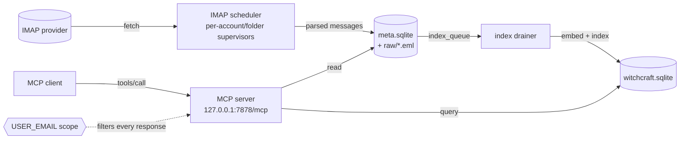

---
sources:
  - scryd/src/main.rs
  - crates/scryd-runtime/src/serve.rs
  - crates/scryd-imap/src/scheduler.rs
  - crates/scryd-search/src/drainer.rs
  - crates/scryd-storage/src/lib.rs
  - crates/scryd-mcp/src/server.rs
  - crates/scryd-mcp/src/scope.rs
---

# Architecture

scryd is a single-purpose daemon. One process does three things and offers no
other control surface:

1. fetches IMAP mail for the account whose login matches `USER_EMAIL`,
2. indexes every message with witchcraft (semantic and full-text), and
3. serves read-only search over MCP on a loopback TCP port.

There is no CLI client, no write surface, and no network listener other than the
loopback MCP server. The binary accepts only `--help` and `--version`; the TOML
config file and the MCP server are the entire interface.

## Components and data flow

- **Scheduler** (`scryd-imap`) owns a tree of per-(account, folder) supervisors.
  Each logs in, backfills history, then watches for new mail. It writes parsed
  messages and raw `.eml` files into storage and enqueues each message for
  indexing. See [IMAP sync](imap-sync.md).
- **Storage** (`scryd-storage`) is the durable metadata store: `meta.sqlite`
  (messages, accounts, sync state, the index queue, daemon-run history) plus a
  `raw/` tree of original `.eml` files. See [Storage](storage.md).
- **Drainer** (`scryd-search`) pulls from `meta.sqlite.index_queue`, embeds and
  indexes each message, and persists vectors and full-text data in
  `witchcraft.sqlite`. See [Indexing and search](indexing-and-search.md).
- **MCP server** (`scryd-mcp`) answers search and read requests over a loopback
  HTTP listener. It reads message bodies from storage and runs queries against
  the witchcraft index. See [MCP interface](../mcp/README.md).
- **MIME** (`scryd-mime`) turns each raw message into a Markdown body and typed
  headers before storage. See [MIME and Markdown](mime-and-markdown.md).

## Process model

The binary at `scryd/src/main.rs` is a thin entry point. It installs a single
rustls crypto provider, caps the rayon and tokio worker pools at
`available_parallelism() - 2` (minimum 1) so the embedding pass does not starve
the IMAP and MCP tasks, parses arguments only to honor `--help`/`--version`, and
calls `scryd_runtime::serve()` on a multi-threaded tokio runtime. Everything
else runs as asynchronous tasks inside that one process: the scheduler, the
drainer, and the MCP server, supervised by the runtime. See
[Daemon lifecycle](lifecycle.md).

## Trust boundary

`USER_EMAIL` is the only authorization boundary. It names the mailbox scryd
serves, and the MCP layer scopes every response to the account(s) whose IMAP
login equals that address (`scryd-mcp/src/scope.rs`). The MCP server binds a
loopback address only and refuses to bind a routable interface. There is no
authentication beyond that boundary because there is no remote surface to
authenticate. See [Security](../security.md) and the
[MCP interface](../mcp/README.md).

## See also

- [Daemon lifecycle](lifecycle.md)
- [IMAP sync](imap-sync.md)
- [Indexing and search](indexing-and-search.md)
- [Storage](storage.md)
- [MCP interface](../mcp/README.md)
